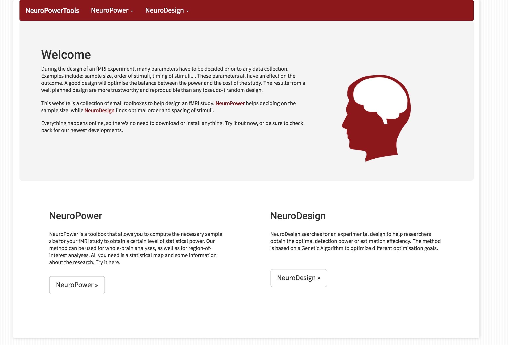

# neuropower

This repository contains the code for the web interface for neuropower.

## AWS Usage

neuropower-web uses a number of AWS services to run neurodesign
optimizations.

### [AWS Batch](https://aws.amazon.com/batch/)

The Batch service is used to execute a neurodesign optimization. Batch jobs 
are submitted by the neuropower-web website and use the same docker image
defined in /neuropower/Dockerfile. Batch requires this docker image to be 
registerd with [AWS ECR](https://aws.amazon.com/ecr/). Once the image is in 
ECR a job definition can be created, 1 vCPU and 3Gb of RAM should be sufficent 
for the job definition.

###  AWS RDS (https://aws.amazon.com/rds/)

A single postgresql RDS database is used to store job configurations 
generated by the main site and read job configurations. The neuropower docker 
image has a python postgresql driver that is compatabile with postgres 9.5. 
The cpu, memory, and storge usage are minimal, the free tier RDS instance 
should be sufficent.

### [AWS S3](https://aws.amazon.com/s3/)

A single AWS S3 bucket is used to store  the results generated by the Batch 
jobs and to serve those results from the website.

### [AWS permissions and access keys](https://aws.amazon.com/iam/)

A single user is used by neuropower-web to utilize the above AWS recources. 
That user will need programatic access, as well as an access key id and 
secret access key that comes with it. The user will need to have the 
following permission policies:
- AmazonRDSFullAccess
- AmazonEC2FullAccess
- AmazonEC2ContainerRegistryFullAccess
- AmazonS3FullAccess
- AWSBatchFullAccess 

### AWS related environemnt variables

The following environment variales will need to be defined in the environment 
that is calling docker-compose:

    - AWS_ACCESS_KEY_ID
    - AWS_SECRET_ACCESS_KEY
    - AWS_STORAGE_BUCKET_NAME
    - AWS_BATCH_JOB_DEFINITION
    - AWS_DEFAULT_REGION
    - AWS_S3_REGION
    - RDS_DB_NAME
    - RDS_USERNAME
    - RDS_PASSWORD
    - RDS_HOSTNAME
    - RDS_PORT

A complete list of environment variables can be found in 
[/neuropower/docker-compose.yml](/neuropower/docker-compose.yml).

## Notes on Django configuration

The Django configuration file being used can be found here 
[/neuropower/settings/settings.py](/neuropower/settings/settings.py)

On job completion an email is sent to the email address that was entered on 
the website before the job was submitted. By default 
[mailgun](https://www.mailgun.com/) is used. This requires the MAILGUN_KEY 
environment variable to be defined. If mailgun isn't used then a new 
[email backend should be defined](https://docs.djangoproject.com/en/1.10/topics/email/#email-backends). 
Otherwise monitoring S3 or Batch will be required to know when a job is complete.

Neuropower-web originially relied on the opbeat service to record logs produced by Django. Opbeat has since shutdown. Logging should be [reconfigured](https://docs.djangoproject.com/en/1.10/topics/logging/#configuring-logging) so that the errors are accessible. Alternatively DEBUG can be set to True if neuropower-web is being run locally for private use.

## Running neuropower-web

Provided all the environemnt variables are defined neuropower-web can be run 
from the neuropower directory using `docker-compose up`. This will start two 
containers, one running uwsgi which executes the Django application, and the 
other running nginx which proxys requests to uwsgi and serves static files.

The uwsgi sevice in the docker-compose file uses the docker hub image for 
neuropower. It may be necessary to switch this service to use `build: ./` 
instead of `image: neuropower/neuropower` to build if there are any issues 
running the dockerhub version of neuropower.

